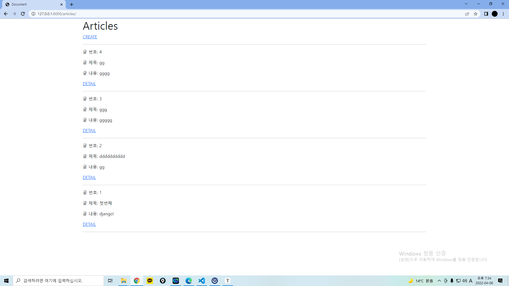
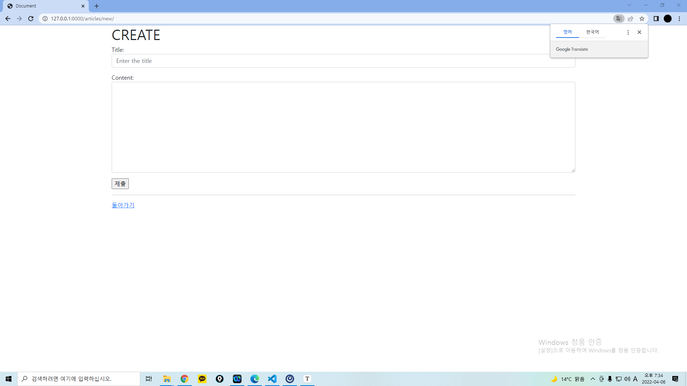
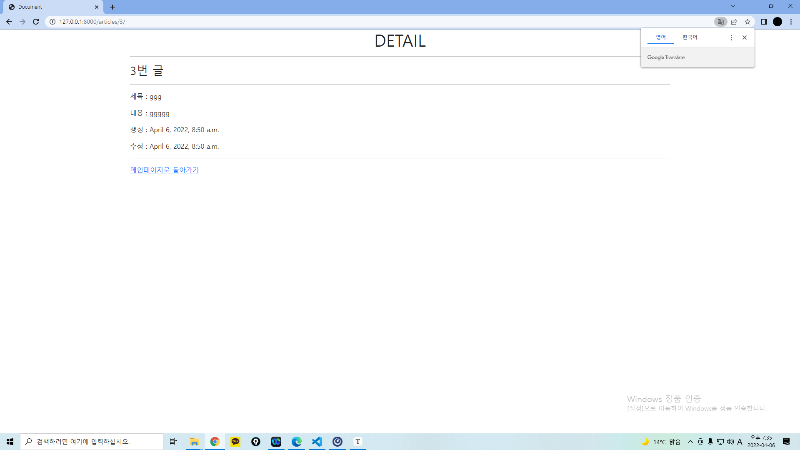

Django Model Form을 활용해 CR을 모두 갖춘 장고 프로젝트를 제작하고 결과 사진과 코드(url, view, template, model)를 별도의 마크다운 파일에 작성하여 제출 하시오.

```
1
from django.urls import path
from . import views

app_name = 'articles'

urlpatterns = [
    path('', views.index, name='index'),
    path('new/', views.new, name='new'),
    path('create/', views.create, name='create'),
    path('<int:pk>/', views.detail, name='detail'),
]

```

```
2
from django.shortcuts import redirect, render
from .models import Article
from .forms import ArticleForm


# Create your views here.

def index(request):
    articles = Article.objects.order_by('-pk')
    context = {
        'articles' : articles,
    }
    return render(request, 'articles/index.html', context)

def new(request):
    form = ArticleForm()
    context = {
        'form' : form,
    }

    return render(request, 'articles/new.html', context)


def create(request):
    if request.method == 'POST':
        form = ArticleForm(request.POST)
        if form.is_valid():
            article = form.save()
            return redirect('articles:detail', article.pk)
    else:
        form = ArticleForm()
    context = {
        'form': form,
    }
    return render(request, 'articles/create.html', context)

def detail(request, pk):
    article = Article.objects.get(pk=pk)
    context ={
        'article' : article,
    }
    return render(request, 'articles/detail.html', context)

```

```
3



  <h1>CREATE</h1>
  <hr>
  <form action="" method="POST">
    
    {{ form.as_p }}
    <input type="submit">
  </form>
  <hr>
  
  
  
  
  

<h1 class="text-center">DETAIL</h1>
  <hr>
  <h3> {{ article.pk }}번 글</h3>
  <hr>
  <p>제목 : {{ article.title }} </p>
  <p>내용 : {{ article.content}} </p>
  <p>생성 : {{ article.created_at }} </p>
  <p>수정 : {{ article.updated_at}} </p>
  <hr>
  <a href="">메인페이지로 돌아가기</a>






  <h1>Articles</h1>
  <a href="">CREATE</a>
  <hr>
  
    <p>글 번호: {{ article.pk}}</p>
    <p>글 제목: {{ article.title}}</p>
    <p>글 내용: {{ article.content}}</p>
    <a href="">DETAIL</a>
    <hr>
  






  <h1>CREATE</h1>
  <form action="" method='POST'>
    
    {{ form.as_p }}
    <input type="submit">
  </form>
  <hr>
  <a href="">돌아가기</a>

  


  
```

```
4
from turtle import update
from django.db import models

# Create your models here.

class Article(models.Model):
    title = models.CharField(max_length=10)
    content = models.TextField()
    created_at = models.DateTimeField(auto_now_add=True)
    updated_at = models.DateTimeField(auto_now=True)

    def __str__(self):
        return self.title
```

```
5
from django import forms
from .models import Article


class ArticleForm(forms.ModelForm):
    title = forms.CharField(
        widget=forms.TextInput(
            attrs={
                'class': 'my-title form-control',
                'placeholder': 'Enter the title',
            }
        )
    )
    content = forms.CharField(
        widget=forms.Textarea(
            attrs={
                'class': 'my-content form-control',
            }
        ),
        error_messages={
            'required': 'Please enter your content!!!',
        }
    )

    class Meta:
        model = Article
        fields = '__all__'
```





