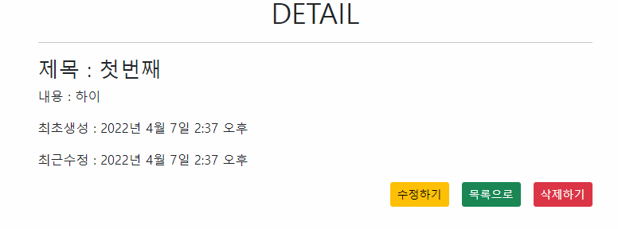
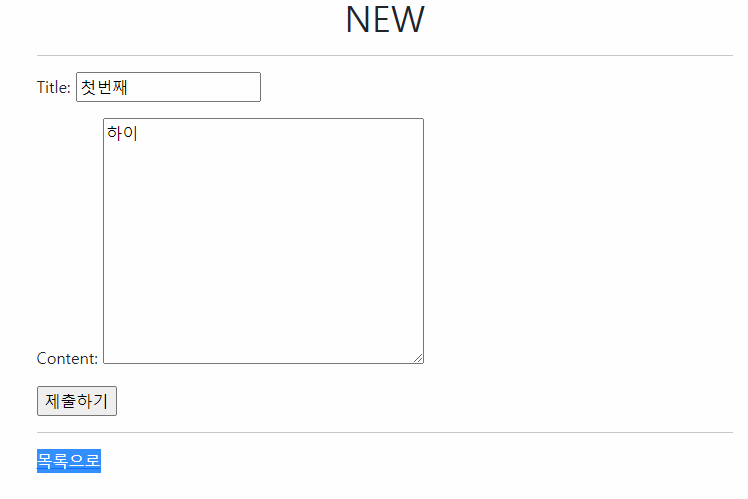
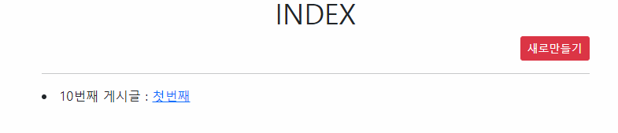
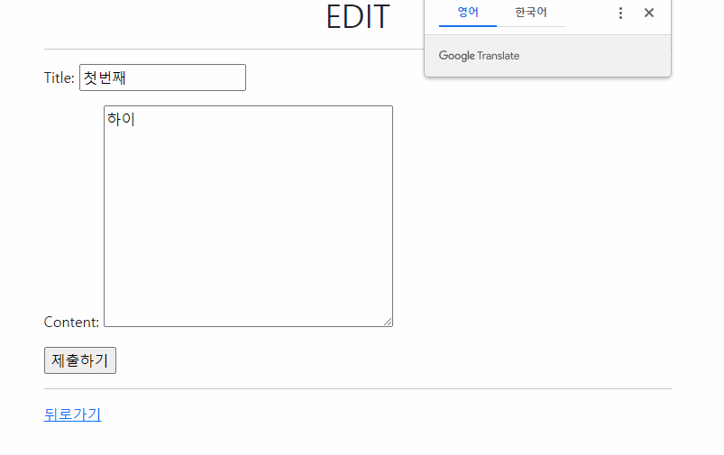

```
url
from django.urls import path
from . import views

app_name = 'articles'

urlpatterns = [
    path('', views.index, name='index'),
    path('new/', views.new, name='new'),
    path('<int:pk>/', views.detail, name='detail'),
    path('<int:pk>/edit/', views.edit, name='edit'),
    path('<int:pk>/delete/', views.delete, name='delete'),
]

```

```
view
from django.shortcuts import redirect, render
from .models import Article
from .forms import ArticleForm

# Create your views here.

def index(request):
    articles = Article.objects.order_by('-pk')
    context = {
        'articles' : articles
    }
    return render(request, 'articles/index.html', context)


def new(request):
    if request.method == 'POST':
        # title = request.POST.get('title')
        # content = request.POST.get('content')
        # article = Article(title=title, content=content)
        # article.save()
        form = ArticleForm(request.POST)
        if form.is_valid():
            article = form.save()
            return redirect('articles:detail', article.pk)
    else:
        form = ArticleForm()
    context = {
        'form' : form,
    }
    return render(request, 'articles/new.html', context)
    

def detail(request, pk):
    article = Article.objects.get(pk=pk)
    context = {
        'article' : article
    }
    return render(request, 'articles/detail.html', context)


def edit(request, pk):
    article = Article.objects.get(pk=pk)
    if request.method == 'POST':
        form = ArticleForm(request.POST, instance=article)
        if form.is_valid():
            article = form.save()
            return redirect('articles:detail', article.pk)
    else:
        form = ArticleForm(instance=article)
    context ={
        'form' : form,
        'article' : article,
    }
    return render(request, 'articles/edit.html', context)
    # if request.method == 'POST':
    #     article.title = request.POST.get('title')
    #     article.content = request.POST.get('content')
    #     article.save()
    #     return redirect('articles:detail', article.pk )
    # else:
    #     context = {
    #         'article' : article
    #     }
    #     return render(request, 'articles/edit.html', context)


def delete(request, pk):
    article = Article.objects.get(pk=pk)
    if request.method == 'POST':
        article.delete()
        return redirect('articles:index')
    else:
        return redirect('articles:detail', article.pk)
```

```
template
detail



  <h1 class="text-center">DETAIL</h1>
  <hr>
    <h3>제목 : {{ article.title }}</h3>
    <p>내용 : {{ article.content }}</p>
    <p>최초생성 : {{ article.created_at }}</p>
    <p>최근수정 : {{ article.updated_at }}</p>
    <div class="d-flex justify-content-end d-grid gap-3">
      <a href="" class="p-0.5">
        <button class="btn btn-warning btn-sm">수정하기</button></a>
      <a href="" class="p-0.5">
        <button class="btn btn-success btn-sm">목록으로</button>
      </a>    
      <form action="" method="POST" class="p-0.5">
        
        <button class="btn btn-danger btn-sm">삭제하기</button>
      </form>
    </div>


edit



  <h1 class="text-center">EDIT</h1>
  <hr>
  <form action="" method="POST">
    
     제목 : <input type="text" name="title" value="{{ article.title }}"><br>
    내용 : <textarea name="content" id="" cols="30" rows="10">{{ article.content }}</textarea>
    <br> 
    {{ form.as_p }}
    <input type="submit" value="제출하기">
  </form>
  <hr>
  <a href="">뒤로가기</a>

index



  <h1 class="text-center">INDEX</h1>
  <div class="d-flex justify-content-end">
    <a href="">
      <button class="btn btn-danger btn-sm">새로만들기</button></a>
  </div>
  <hr>
  
  <li>{{ article.pk }}번째 게시글 : <a href="">{{ article.title }}</a></li>
  

new



  <h1 class="text-center">NEW</h1>
  <hr>
  <form action="" method="POST">
    
     제목 : <input type="text" name="title"><br>
    내용 : <textarea name="content" id="" cols="30" rows="10"></textarea>
    <br> 
    {{ form.as_p }}
    <input type="submit" value="제출하기">
  </form>
  <hr>
  <a href="">목록으로</a>

```

```
model
from django.db import models

# Create your models here.

class Article(models.Model):
    title = models.CharField(max_length=10)
    content = models.TextField(null=True)
    created_at = models.DateTimeField(auto_now_add=True)
    updated_at = models.DateTimeField(auto_now=True)

    def __str__(self):
        return f'{self.pk} : {self.title}'
```







