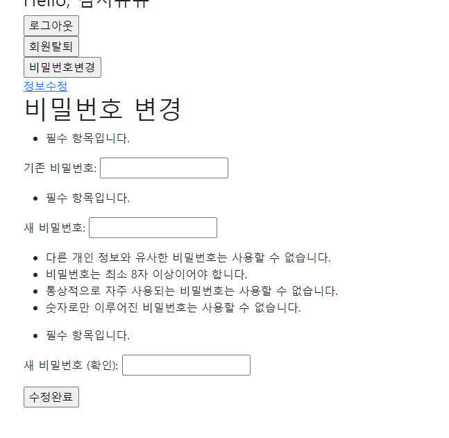

```
@login_required
@require_http_methods(['GET','POST'])
def change_password(request):
    if request.method == 'POST':
        # PasswordChangeForm의 첫번째는 항상 user여야 한다
        form = PasswordChangeForm(user=request.user, data=request.POST)
        if form.is_valid():
            user=form.save()
            # case 1
            # auth_login(request, user)
            # case 2
            # session을 new 비번에 맞추어 변경
            # update_session_auth_hash(request, user)
            # case 3
            update_session_auth_hash(request,form.user)
            return redirect('articles:index')
    else:
        form = PasswordChangeForm(request.user)
    context = {
        'form' : form
    }
    return render(request, 'accounts/change_password.html', context)
```

