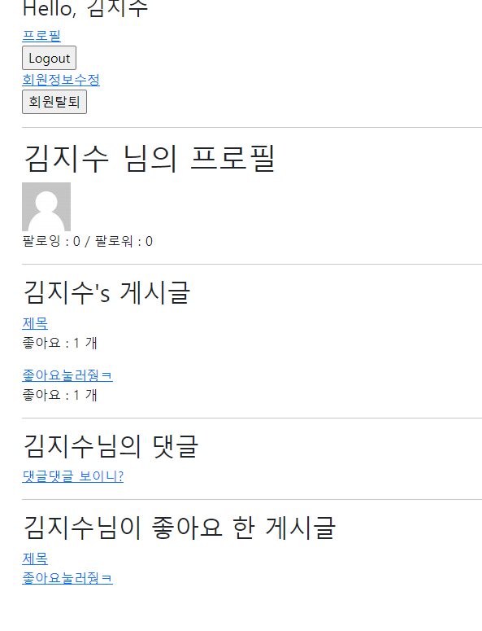

```
import imp
from django.contrib.auth import login as auth_login
from django.contrib.auth import logout as auth_logout
from django.contrib.auth import update_session_auth_hash
from django.contrib.auth.decorators import login_required
from django.contrib.auth.forms import (
    AuthenticationForm, 
    UserCreationForm, 
    PasswordChangeForm,
)
from django.views.decorators.http import require_http_methods, require_POST
from django.shortcuts import render, redirect, get_object_or_404
from .forms import CustomUserChangeForm, CustomUserCreationForm

from django.contrib.auth import get_user_model

# Create your views here.
@require_http_methods(['GET', 'POST'])
def login(request):
    if request.user.is_authenticated:
        return redirect('articles:index')

    if request.method == 'POST':
        form = AuthenticationForm(request, request.POST)
        if form.is_valid():
            # 로그인
            auth_login(request, form.get_user())
            return redirect(request.GET.get('next') or 'articles:index')
    else:
        form = AuthenticationForm()
    context = {
        'form': form,
    }
    return render(request, 'accounts/login.html', context)


@require_POST
def logout(request):
    if request.user.is_authenticated:
        auth_logout(request)
    return redirect('articles:index')


@require_http_methods(['GET', 'POST'])
def signup(request):
    if request.user.is_authenticated:
        return redirect('articles:index')

    if request.method == 'POST':
        form = CustomUserCreationForm(request.POST)
        if form.is_valid():
            user = form.save()
            auth_login(request, user)
            return redirect('articles:index')
    else:
        form = CustomUserCreationForm()
    context = {
        'form': form,
    }
    return render(request, 'accounts/signup.html', context)


@require_POST
def delete(request):
    if request.user.is_authenticated:
        # 반드시 회원탈퇴 후 로그아웃 함수 호출
        request.user.delete()
        auth_logout(request)
    return redirect('articles:index')


@login_required
@require_http_methods(['GET', 'POST'])
def update(request):
    if request.method == 'POST':
        form = CustomUserChangeForm(request.POST, instance=request.user)
        if form.is_valid():
            form.save()
            return redirect('articles:index')
    else:
        form = CustomUserChangeForm(instance=request.user)
    context = {
        'form': form,
    }
    return render(request, 'accounts/update.html', context)


@login_required
@require_http_methods(['GET', 'POST'])
def change_password(request):
    if request.method == 'POST':
        form = PasswordChangeForm(request.user, request.POST)
        if form.is_valid():
            # user = form.save()
            # update_session_auth_hash(request, user)
            form.save()
            update_session_auth_hash(request, form.user)
            return redirect('articles:index')
    else:
        form = PasswordChangeForm(request.user)
    context = {
        'form': form,
    }
    return render(request, 'accounts/change_password.html', context)


def profile(request, username):
    person = get_object_or_404(get_user_model(), username=username)

    context = {
        'person' : person,
    }
    return render(request, 'accounts/profile.html', context)


def follow(request, user_pk):
    if request.user.is_authenticated:
        # 팔로우 할 사람을 person에 담음
        person = get_object_or_404(get_user_model(), pk=user_pk)
        if person != request.user:
            # 언팔
            if person.followers.filter(pk=request.user.pk).exists():
                person.followers.remove(request.user)
            # 팔로우
            else:
                person.followers.add(request.user)
        
        return redirect('acoounts:profile', person.username)
    return redirect('accounts:login')
```

```
from django.db import models
from django.contrib.auth.models import AbstractUser

# Create your models here.
class User(AbstractUser):

    # a유저는 여러명의 팔로우를 가질 수 있다
    # a유저는 여러명의 유저를 팔로잉 할 수 있다
    following = models.ManyToManyField('self', symmetrical=False, related_name='followers')
```

```





<h1> {{ person.username }} 님의 프로필</h1>




<div>
  팔로잉 : {{ followings|length }} / 팔로워 : {{ followers|length}}
</div>

<div>
  
    <div>
      <form action="" method="POST">
        
        
          <button>Unfolow</button>
        
          <button>Follow</button>
        
      </form>
    </div>
  
</div>

<hr>
<h2>{{ person.username }}'s 게시글 </h2>

  <div>
    <a href="">{{ article.title }}</a>
    <p>좋아요 : {{ article.like_users.count }} 개</p>
  </div>


<hr>
<h2>{{ person.username }}님의 댓글</h2>

  <div>
    <a href="">{{ comment.content }}</a>
  </div>


<hr>
<h2>{{ person.username }}님이 좋아요 한 게시글</h2>

  <div>
    <a href="">{{ article.title}}</a>
  </div>


```

