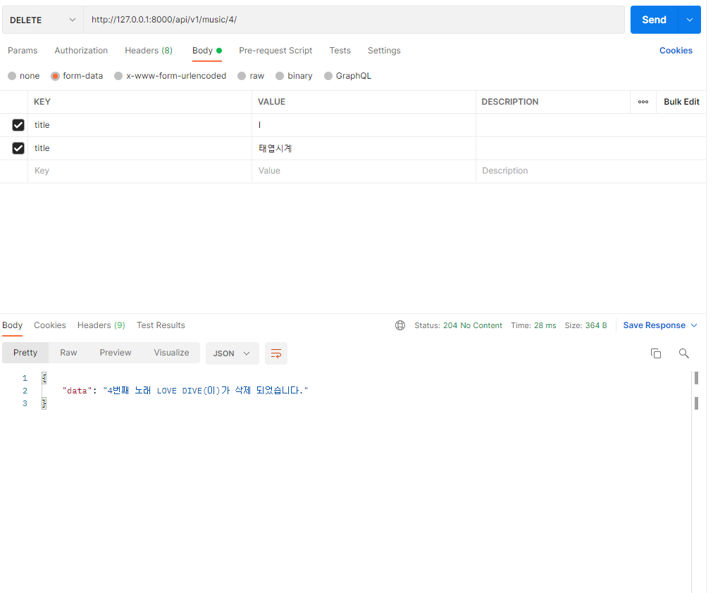
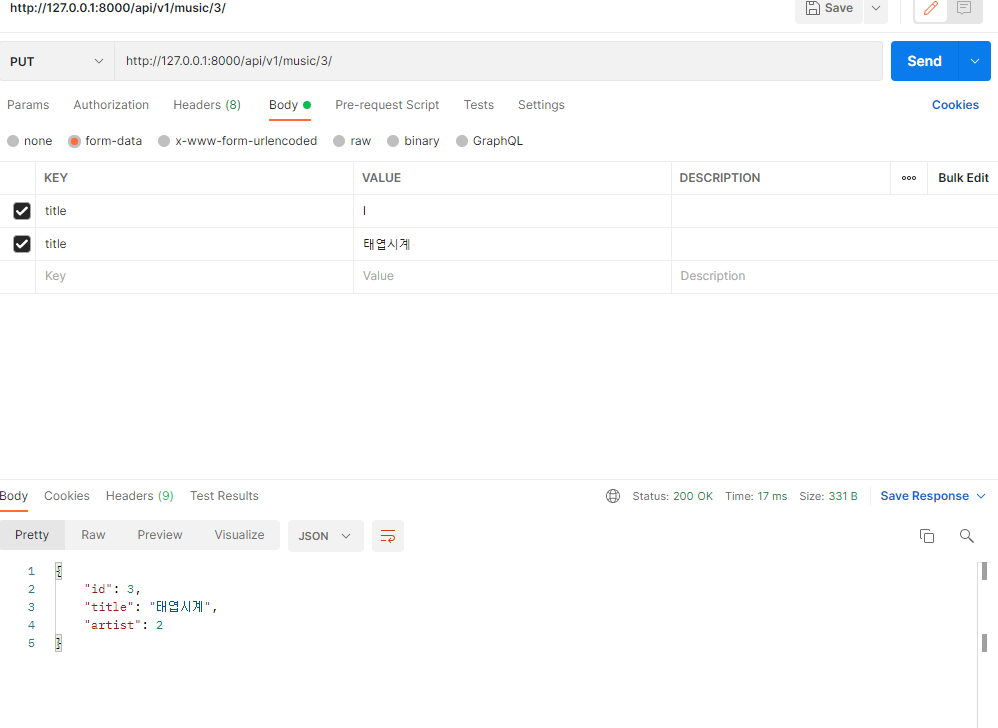
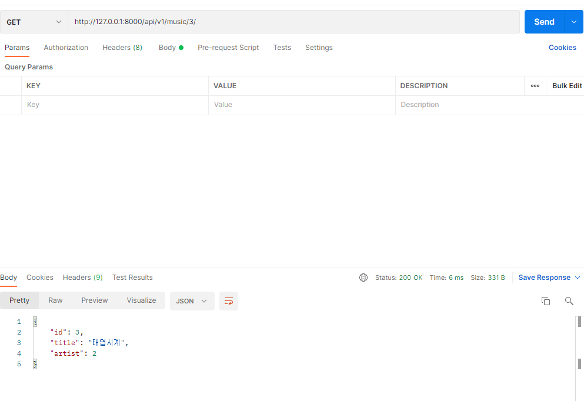
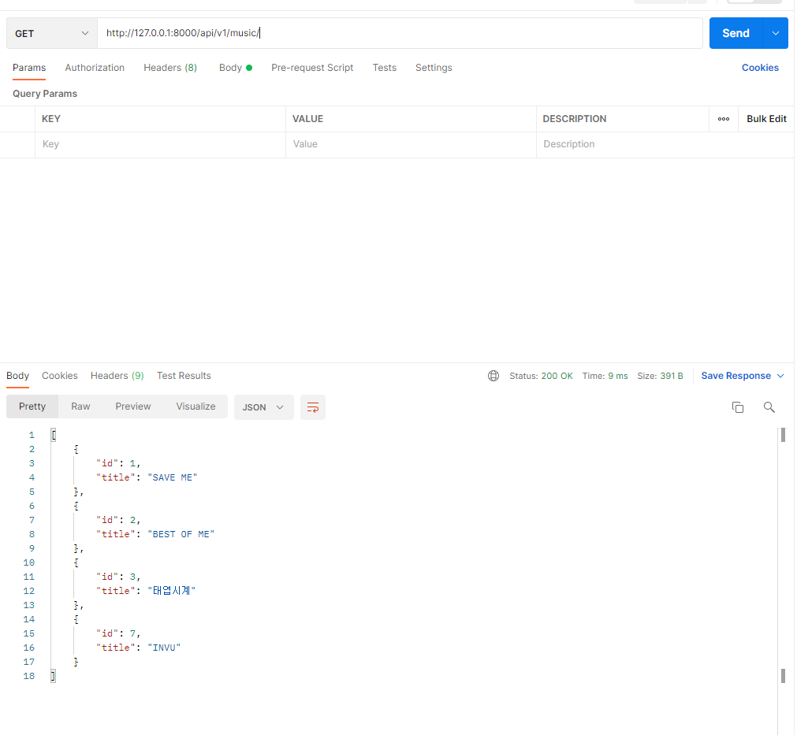
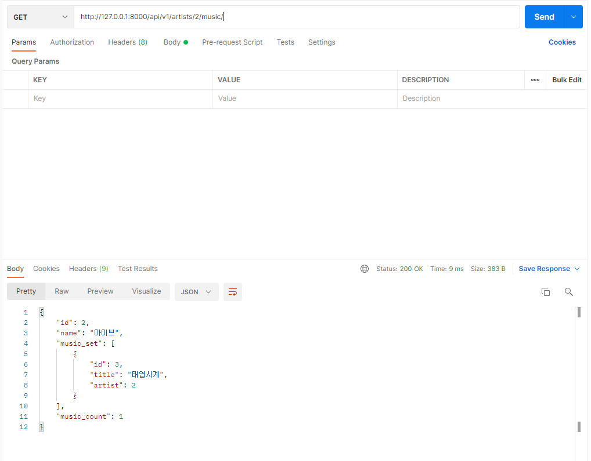
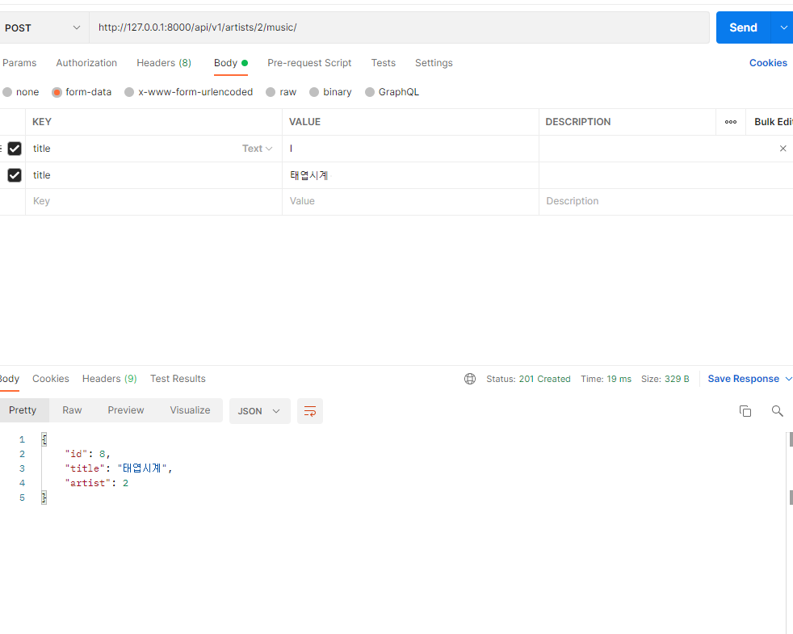
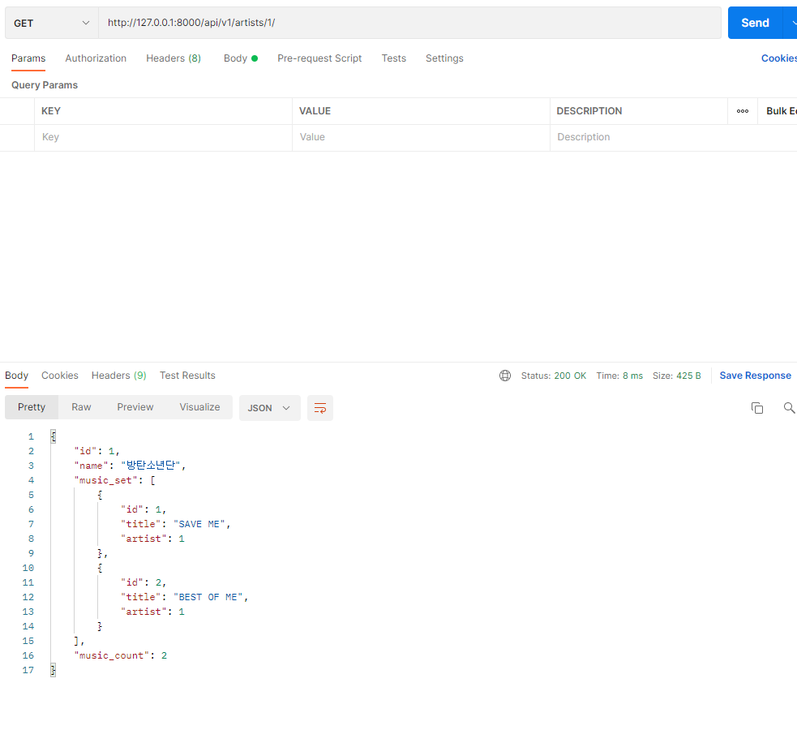
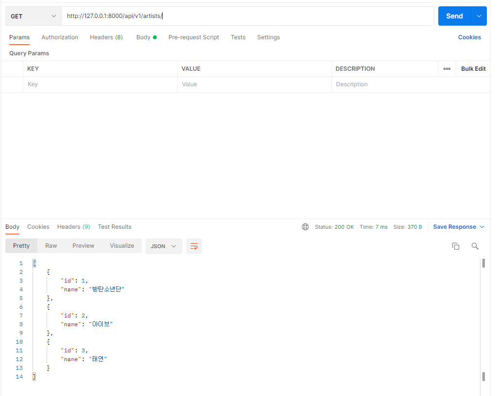

1. ```
   from logging import raiseExceptions
   from django.shortcuts import render, get_list_or_404, get_object_or_404
   from .models import Artist, Music
   from .serializers import ArtistListSerializer, ArtistSerializer, MusicListSerializer, MusicSerializer
   from rest_framework.response import Response
   from rest_framework import status
   from rest_framework.decorators import api_view
   
   from music import serializers
   
   # Create your views here.
   
   @api_view(['GET', 'POST'])
   def artists_list(request):
         if request.method == 'GET':
               artists = get_list_or_404(Artist)
               serializer = ArtistListSerializer(artists, many=True)
               return Response(serializer.data)
   
         elif request.method == 'POST':
               serializer = ArtistListSerializer(data=request.data)
               if serializer.is_valid(raise_exception=True):
                     serializer.save()
                     return Response(serializer.data, status=status.HTTP_201_CREATED)
   
   
   @api_view(['GET', 'POST'])
   def artists_detail(request, artists_pk):
         artist = get_object_or_404(Artist, pk=artists_pk)
         
         if request.method == 'GET':
               serializer = ArtistSerializer(artist)
               return Response(serializer.data)
   
   
         elif request.method == 'POST':
               serializer = MusicSerializer(data=request.data)
               if serializer.is_valid(raise_exception=True):
                     serializer.save(artist=artist)
                     return Response(serializer.data, status=status.HTTP_201_CREATED)
   
   
   
   
   @api_view(['GET'])
   def music_list(request):
         music = get_list_or_404(Music)
         serializer = MusicListSerializer(music, many=True)
         return Response(serializer.data)
   
   
   @api_view(['GET','PUT','DELETE'])
   def music_detail(request, music_pk):
         music = get_object_or_404(Music, pk=music_pk)
   
         if request.method == 'GET':
               serializer = MusicSerializer(music)
               return Response(serializer.data)
   
         elif request.method == 'PUT':
               serializer = MusicSerializer(music, data=request.data)
               if serializer.is_valid(raise_exception=True):
                     serializer.save()
                     return Response(serializer.data)
   
         elif request.method == 'DELETE':
               music.delete()
               data = {
                     'data' : f'{music_pk}번째 노래 {music.title}(이)가 삭제 되었습니다.'
               }
               return Response(data, status=status.HTTP_204_NO_CONTENT)
   ```

2. 

   

   

   

   

   

   

   